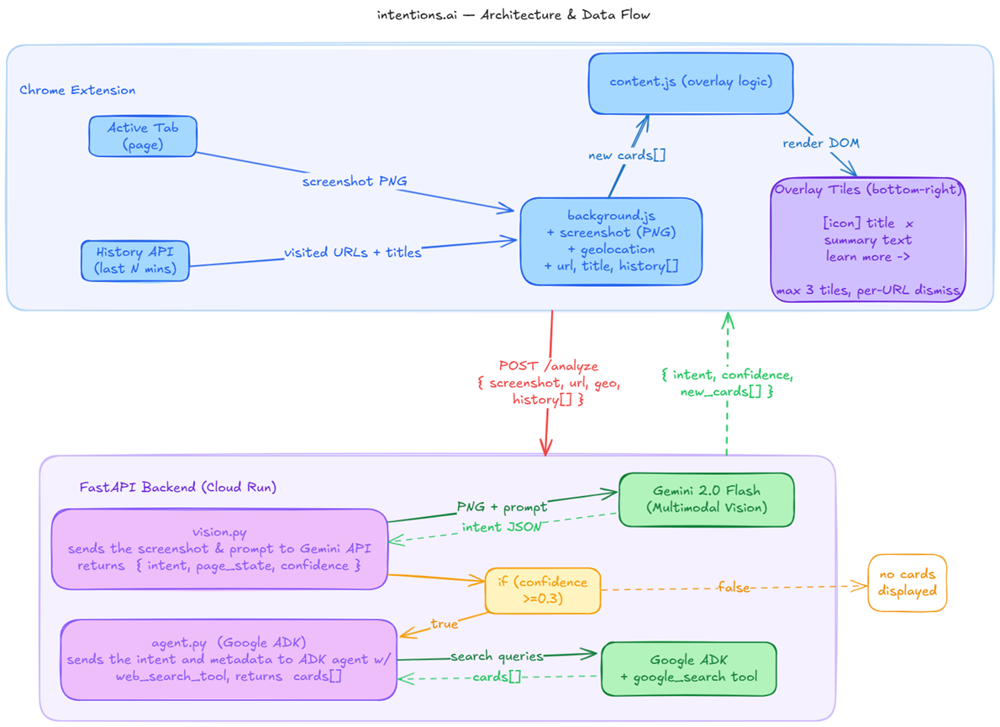

# UI Navigator — Proactive Browser Assistant

> Gemini Live Agent Challenge — UI Navigator category

Watches your active browser tab via screenshots, uses Gemini's multimodal vision to infer your intent, and surfaces relevant information **before you ask**.

**Demo scenario:** User opens the USCIS biometrics rescheduling page → the assistant surfaces community insights from Reddit about wait times. User selects "San Francisco" as the appointment location → the assistant surfaces tourist spots near that USCIS office.

---

## Architecture



---

## Quickstart

### 1. Backend (local)

```bash
cd backend
python -m venv .venv
# Windows:
.venv\Scripts\activate
# macOS/Linux:
source .venv/bin/activate

pip install -r requirements.txt

# Create .env with your key:
echo "GOOGLE_API_KEY=your-key-here" > .env

uvicorn main:app --reload --port 8080
```

Test:
```bash
curl http://localhost:8080/health
```

### 2. Chrome Extension

1. Set `BACKEND_URL` in `extension/background.js` (line 4) to `http://localhost:8080` (local) or your deployed Cloud Run URL.
2. Open `chrome://extensions/` → Enable **Developer mode** → **Load unpacked** → select the `extension/` folder.
3. Any time you change `BACKEND_URL`, click the **reload icon** on the extension card in `chrome://extensions/` for the change to take effect.
4. Navigate to any page — the extension runs passively in the background. Tiles appear bottom-right within ~5 seconds if Gemini infers your intent with confidence ≥ 0.3. On low-confidence pages (blank tabs, internal pages) nothing is shown.

---

## Testing

### 1. Health check
```bash
curl https://YOUR_CLOUD_RUN_URL/health
# Expected: {"status":"ok"}
```

### 2. Backend end-to-end (minimal 1×1 PNG)
```bash
curl -s -X POST https://YOUR_CLOUD_RUN_URL/analyze \
  -H "Content-Type: application/json" \
  -d '{
    "screenshot": "iVBORw0KGgoAAAANSUhEUgAAAAEAAAABCAYAAAAfFcSJAAAADUlEQVR42mNk+M9QDwADhgGAWjR9awAAAABJRU5ErkJggg==",
    "url": "https://example.com",
    "title": "Test"
  }'
# Expected: {"intent":"...","page_state":"...","confidence":<float>,"cards":[]}
```

### 3. Extension smoke test
1. Load the extension in `chrome://extensions/` (Developer mode → Load unpacked → `extension/`)
2. Open any public webpage (e.g. `https://my.uscis.gov` or a Google search)
3. Open DevTools → **Service Worker** console for the extension
4. Within ~5 seconds you should see a POST to `/analyze` logged — and tiles appear bottom-right if confidence ≥ 0.3 and the agent returns cards

### 4. Low-confidence skip
Navigate to `chrome://newtab` — the extension skips it (chrome:// pages are filtered) and no request is sent.

---

## Deploy to Cloud Run

### Prerequisites
- [Google Cloud SDK](https://cloud.google.com/sdk/docs/install) installed and authenticated
- A GCP project with billing enabled
- Gemini API key stored in Secret Manager as `google-api-key`

```bash
# One-time setup
gcloud config set project YOUR_PROJECT_ID
gcloud secrets create google-api-key --data-file=- <<< "your-api-key"

# Build and deploy
gcloud builds submit --config cloudbuild.yaml
```

After deploy, update `BACKEND_URL` in `extension/background.js` (line 4) with your Cloud Run URL, then reload the extension.

---

## API

### `POST /analyze`

**Request:**
```json
{
  "screenshot": "<base64 PNG>",
  "url": "https://my.uscis.gov/...",
  "title": "USCIS - Reschedule Appointment",
  "geolocation": { "lat": 37.7749, "lng": -122.4194 }
}
```

**Response:**
```json
{
  "intent": "rescheduling a USCIS biometrics appointment",
  "page_state": "User is on the appointment selection form, no city selected yet",
  "confidence": 0.92,
  "cards": [
    {
      "id": "uscis-reschedule-tips",
      "title": "USCIS Biometrics Rescheduling Tips",
      "summary": "Reddit users report slots open Tues mornings. Bring original appointment notice + ID.",
      "icon": "📋",
      "link": "https://reddit.com/r/USCIS"
    }
  ]
}
```

---

## Tech Stack

| Layer | Technology |
|---|---|
| Chrome Extension | Manifest V3, vanilla JS |
| Backend | Python FastAPI |
| Vision | Gemini 2.0 Flash (multimodal image input) |
| Agent framework | Google ADK (`google-adk`) |
| Search | Google Search grounding via ADK |
| Deploy | Google Cloud Run |
| CI/CD | Cloud Build (`cloudbuild.yaml`) |

---

## File Structure

```
interactive-ui/
├── extension/
│   ├── manifest.json
│   ├── background.js      # screenshot capture + backend calls
│   ├── content.js         # overlay injection + mutation detection
│   └── overlay.css        # tile styles
├── backend/
│   ├── main.py            # FastAPI /analyze endpoint
│   ├── vision.py          # Gemini multimodal screenshot → intent
│   ├── agent.py           # ADK agent: intent → web_search → cards
│   └── requirements.txt
├── Dockerfile
├── cloudbuild.yaml
└── README.md
```

---

## Hackathon Compliance

- **Gemini multimodal** — `vision.py` sends the raw screenshot image to `gemini-2.0-flash`; intent is inferred visually, not from DOM text extraction
- **Google ADK** — `agent.py` uses `google-adk` `Agent` + `Runner` with `google_search` tool
- **Google Cloud Run** — `Dockerfile` + `cloudbuild.yaml` deploy to Cloud Run
- **Google Cloud service** — Cloud Run + optional Secret Manager for API key storage
